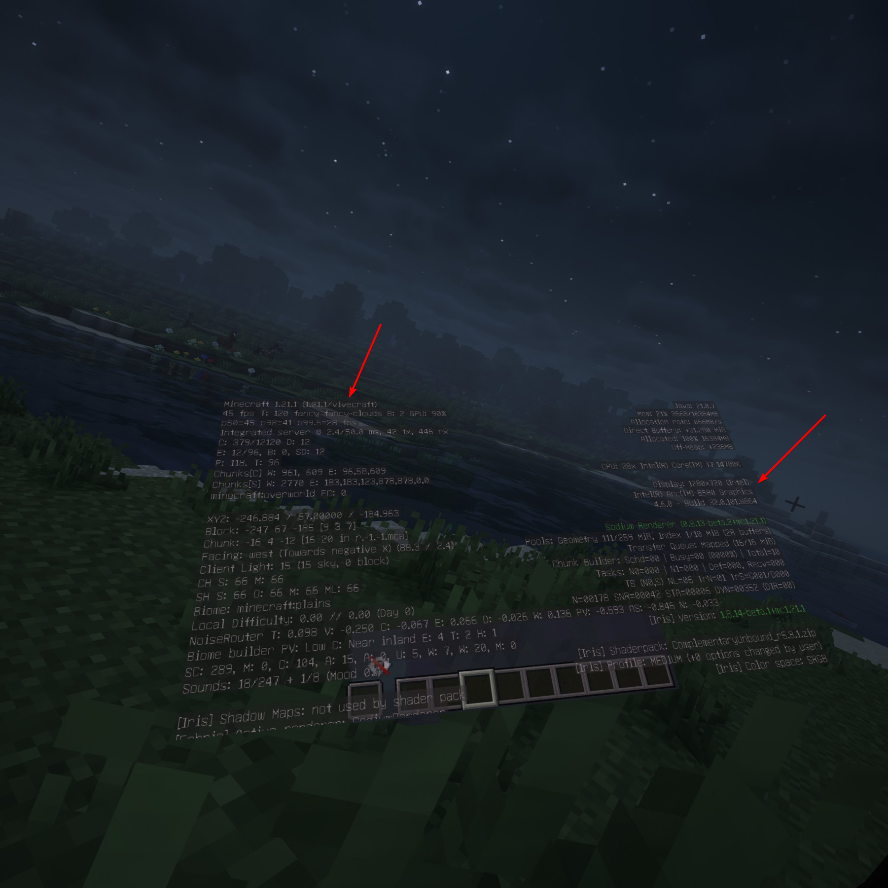

# IntelOpenGLVRFix

English | [简体中文](README.zh-CN.md)

`IntelOpenGLVRFix` fixes an issue on Windows systems with Intel Arc graphics cards where VR applications using OpenGL through SteamVR run normally but display no image in the headset.

The project contains two components:

- `opengl32.dll`: An OpenGL compatibility implementation that fixes texture sharing between OpenGL and Direct3D 11 in the Intel Arc driver.
- `openvr_api.dll`: An optional OpenVR preloader that ensures the modified `opengl32.dll` is loaded before SteamVR's `vrclient_x64.dll`.

## Usage

Download `release.zip` from Releases and extract it.

### General VR Applications

Place `opengl32.dll` in the directory containing the game's main executable.

### [Vivecraft](https://github.com/Vivecraft/VivecraftMod/)

Place `opengl32.dll` in the directory containing the `java.exe` / `javaw.exe` actually used by Minecraft.

Open `config/vivecraft-client-config.json` in the Minecraft instance directory and change `blockIntelWindows` from `"true"` to `"false"`:

```json
"blockIntelWindows": "false"
```

### [OpenVR Advanced Settings](https://github.com/OpenVR-Advanced-Settings/OpenVR-AdvancedSettings/)

When OpenVR Advanced Settings loads SteamVR, `vrclient_x64.dll` loads the native `opengl32.dll` from the system directory. In this case, placing only the modified `opengl32.dll` will not work, so the preloader is also required:

1. Open the OpenVR Advanced Settings installation directory.
2. Rename the existing `openvr_api.dll` to `openvr_api_original.dll`.
3. Place `openvr_api.dll` and `opengl32.dll` from the archive in this directory.

The new `openvr_api.dll` loads `opengl32.dll` from the same directory first and forwards all OpenVR calls to `openvr_api_original.dll`.

Do not install these DLLs globally by placing them in `System32` or the SteamVR installation directory. Deploy them only to the application directory that requires the fix to avoid affecting other applications.

> [!WARNING]
> This project provides graphics compatibility only. It does not modify game data or provide any cheating functionality. However, anti-cheat systems may still identify third-party DLLs as unexpected modules, which can trigger detection or result in account penalties or bans. Therefore, using this project at the same time as VRChat or other games protected by anti-cheat systems is not recommended. A typical case is running VRChat alongside **OpenVR Advanced Settings** modified with this project.

## Cause

SteamVR uses `WGL_NV_DX_interop` to share rendering textures between OpenGL and Direct3D 11.

As of the time this project was written, the `WGL_NV_DX_interop` implementation in Intel Arc driver 32.0.101.8864 still cannot correctly handle the D3D11 shared textures created by SteamVR, resulting in no image in the headset.

`IntelOpenGLVRFix` provides a compatible implementation that fixes texture sharing between OpenGL and Direct3D 11.

## Tested Environment

Hardware and runtime environment:

- System: Windows 11 25H2 26200.8875
- GPU: Intel Arc B580, driver 32.0.101.8864
- Headset: Quest 2
- Streaming: [Virtual Desktop](https://www.vrdesktop.net/) 1.34.18
- VR Runtime: [SteamVR](https://store.steampowered.com/app/250820/SteamVR/) 2.16.7

Verified applications:

- [Desktop+](https://github.com/elvissteinjr/DesktopPlus/) 3.5: Desktop content displays correctly in the headset after using `opengl32.dll`.
- [OpenVR Advanced Settings](https://github.com/OpenVR-Advanced-Settings/OpenVR-AdvancedSettings/) 5.8.11: Overlay content displays correctly in the headset after using `opengl32.dll` and the `openvr_api.dll` preloader.
- [Vivecraft](https://github.com/Vivecraft/VivecraftMod/) 1.21.1-1.3.15, Minecraft 1.21.1, [NeoForge](https://github.com/neoforged/neoforge/) 21.1.248: The game renders correctly through SteamVR after deploying `opengl32.dll` to the Java directory actually in use.



## Manual Build

```
cmake --workflow --preset release
```

## Acknowledgments

- [RenderDoc](https://github.com/baldurk/renderdoc/)
- [Mesa Gallium](https://gitlab.freedesktop.org/mesa/mesa/-/tree/main/src/gallium/)
