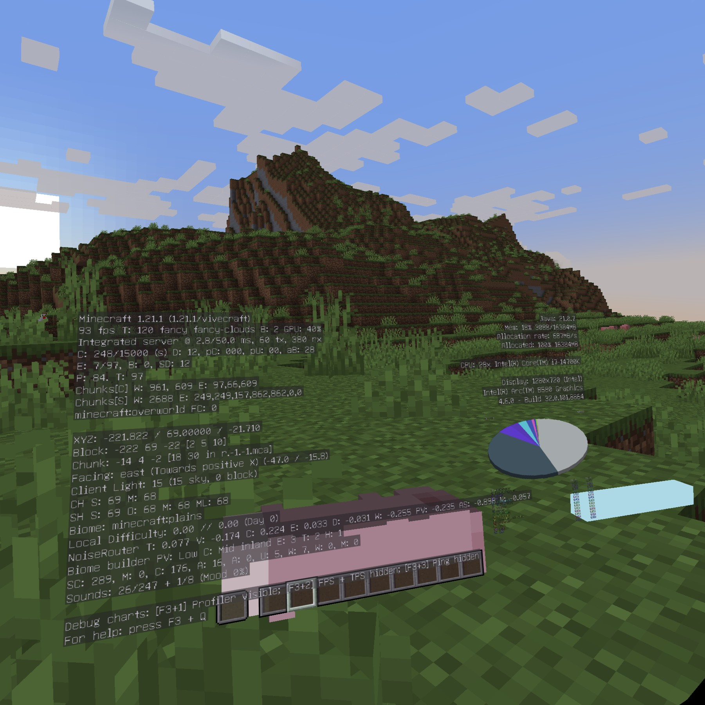

# IntelOpenGLVRFix

[English](README.md) | 简体中文

`IntelOpenGLVRFix` 用于修复在 Windows 系统上 Intel Arc 显卡上通过 SteamVR 运行使用 OpenGL 的 VR 应用时，应用正常运行但头显中没有画面的问题。

项目包含两个组件：

- `opengl32.dll`：OpenGL 兼容实现，修复 Intel Arc 驱动 OpenGL 与 Direct3D 11 之间的纹理共享问题。
- `openvr_api.dll`：可选的 OpenVR preloader，用于确保修改后的 `opengl32.dll` 在 SteamVR 的 `vrclient_x64.dll` 之前加载。

## 使用方法

从 Releases 下载 `release.zip` 并解压。

### 普通 VR 应用

将 `opengl32.dll` 放到游戏主程序所在目录。

### [Vivecraft](https://github.com/Vivecraft/VivecraftMod/)

将 `opengl32.dll` 放到 Minecraft 实际使用的 `java.exe` / `javaw.exe` 所在目录。

打开 Minecraft 实例目录下的 `config/vivecraft-client-config.json`，将 `blockIntelWindows` 从 `"true"` 修改为 `"false"`：

```json
"blockIntelWindows": "false"
```

### [OpenVR Advanced Settings](https://github.com/OpenVR-Advanced-Settings/OpenVR-AdvancedSettings/)

OpenVR Advanced Settings 加载 SteamVR 时，`vrclient_x64.dll` 会从系统目录加载原生 `opengl32.dll`。此时仅放置修改后的 `opengl32.dll` 不会生效，需要同时使用 preloader：

1. 打开 OpenVR Advanced Settings 的安装目录。
2. 将原有的 `openvr_api.dll` 改名为 `openvr_api_original.dll`。
3. 将压缩包中的 `openvr_api.dll` 和 `opengl32.dll` 放入该目录。

新的 `openvr_api.dll` 会先加载同目录的 `opengl32.dll`，并将所有 OpenVR 调用转发给 `openvr_api_original.dll`。

不要将 DLL 放入 `System32` 或 SteamVR 安装目录进行全局安装。仅部署到需要修复的应用目录，避免影响其他应用。

> [!WARNING]
> 本项目仅提供图形兼容功能，不修改游戏数据，也不提供任何作弊功能。但反作弊系统仍可能将第三方 DLL 识别为异常模块，从而触发检测或导致账号受到处罚，甚至封禁。因此，不建议将本项目与 VRChat 等启用反作弊系统的游戏同时使用。典型场景是同时运行 VRChat 与安装了本项目修复的 **OpenVR Advanced Settings**。

## 问题原因

SteamVR 通过 `WGL_NV_DX_interop` 在 OpenGL 与 Direct3D 11 之间共享渲染纹理。

截至本项目编写时，Intel Arc 驱动 32.0.101.8864 的 `WGL_NV_DX_interop` 实现仍无法正确处理 SteamVR 创建的 D3D11 共享纹理，导致头显中没有画面。

`IntelOpenGLVRFix` 通过提供兼容实现，修复 OpenGL 与 Direct3D 11 之间的纹理共享。

## 已测试环境

已验证应用：

- [OpenVR Advanced Settings](https://github.com/OpenVR-Advanced-Settings/OpenVR-AdvancedSettings/) 5.8.11：使用 `opengl32.dll` 和 `openvr_api.dll` preloader 后，overlay 内容能在头显中正常显示。
- [Vivecraft](https://github.com/Vivecraft/VivecraftMod/) 1.21.1-1.3.15，Minecraft 1.21.1，[NeoForge](https://github.com/neoforged/neoforge/) 21.1.248：将 `opengl32.dll` 部署到实际使用的 Java 目录后，游戏画面能够通过 SteamVR 正常显示。

### Vivecraft 非专业性能测试

以下结果来自实际游玩截图，并非标准化性能基准测试，仅供参考。

共同测试配置：

- 系统：Windows 11 25H2 26200.8875
- 处理器：Intel Core i7-14700K
- 显卡：Intel Arc B580，驱动 32.0.101.8864
- 头显：Quest 2
- 串流：[Virtual Desktop](https://www.vrdesktop.net/) 1.34.18
- VR Runtime：[SteamVR](https://store.steampowered.com/app/250820/SteamVR/) 2.16.7
- 游戏：[Vivecraft](https://github.com/Vivecraft/VivecraftMod/) 1.21.1-1.3.15，Minecraft 1.21.1，[NeoForge](https://github.com/neoforged/neoforge/) 21.1.248
- Java：Adoptium OpenJDK
- Minecraft 分配内存：16 GB
- 测试场景：新创建的 Minecraft 世界

#### 无光影

- Virtual Desktop 图形质量：Medium
- Synchronous Spacewarp (SSW)：关闭
- SteamVR 渲染比例：100%
- Vivecraft 渲染比例：100%
- 视距：12 区块



#### Complementary Unbound 光影

- Virtual Desktop 图形质量：Medium
- Synchronous Spacewarp (SSW)：开启，游戏内显示的 FPS 为头显实际画面帧率的一半
- SteamVR 渲染比例：100%
- Vivecraft 渲染比例：130%
- 视距：12 区块
- 优化模组：Sodium + Iris
- 光影：Complementary Unbound r5.8.1，Medium 预设


## 手动构建

```
cmake --workflow --preset release
```

## 致谢

- [RenderDoc](https://github.com/baldurk/renderdoc/)
- [Mesa Gallium](https://gitlab.freedesktop.org/mesa/mesa/-/tree/main/src/gallium/)
